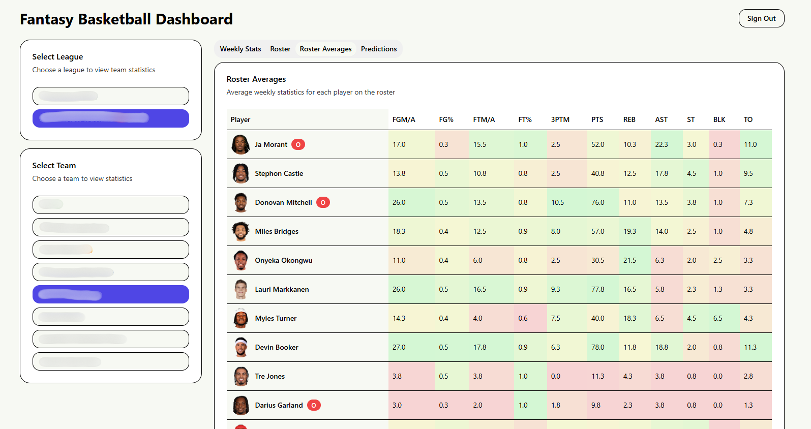

# Fantasy Basketball Tool

A Next.js application for analyzing Yahoo Fantasy Basketball league data, including roster statistics, weekly matchups, and performance predictions.



## Prerequisites

- Node.js 20+
- pnpm (recommended) or npm/yarn/bun
- Yahoo Fantasy API Client ID ([Get one here](https://developer.yahoo.com/))

## Getting Started

### 1. Install Dependencies

```bash
pnpm install
```

### 2. Environment Variables

Create a `.env.local` file in the root directory:

```env
YAHOO_CLIENT_ID=your_yahoo_client_id_here
```

### 3. Run Development Server

```bash
pnpm run dev
```

The app runs with experimental HTTPS on `https://localhost:3000` (required for OAuth callbacks).

**Note**: You may need to accept the self-signed certificate in your browser on first visit.

### 4. Build for Production

```bash
pnpm run build
pnpm start
```
